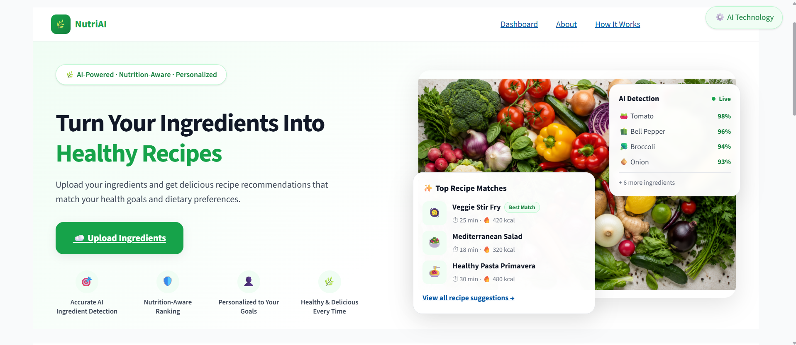
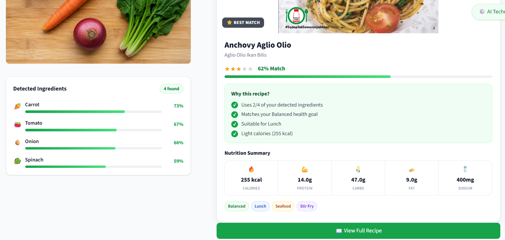
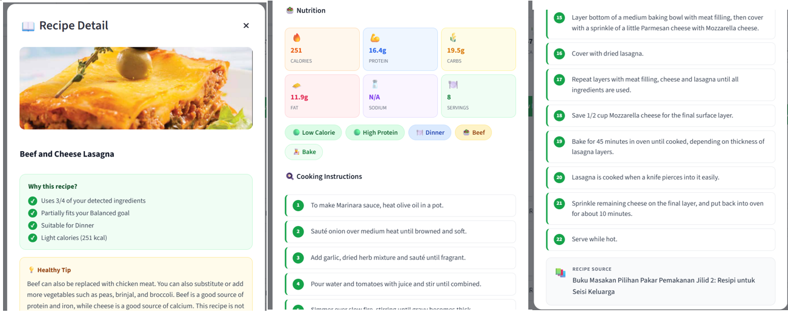

# NutriAI — Vision-Based Ingredient Detection & Healthy Recipe Recommender

NutriAI is a deep learning application that identifies raw food ingredients from a photo and recommends healthy recipes built around them. It combines a fine-tuned **EfficientNetB0** image classifier with a rule-based nutrition-aware recommendation engine, all wrapped in an interactive **Streamlit** web app.

This project was built as a Final Year Project (FYP).

---

## Overview

A user uploads (or takes) a photo of one or more raw ingredients. NutriAI:

1. Classifies the ingredient(s) in the image using a CNN trained on 36 ingredient classes.
2. Matches the detected ingredients against a recipe database.
3. Recommends recipes ranked by ingredient overlap and the user's selected health goal (e.g. Low Sodium, High Protein, Low Calorie, Low Fat, Balanced).

---

## Features

- **Ingredient detection** from photos using a fine-tuned EfficientNetB0 model
- **36 supported ingredient classes** (fruits and vegetables)
- **Health-goal-aware recipe recommendation** (Balanced, Low Sodium, High Protein, Low Calorie, Low Fat)
- **Ingredient synonym normalisation** (e.g. "capsicum" → "bell pepper", "brinjal" → "eggplant") for robust matching against the recipe database
- **SQLite-backed recipe database** with nutrition information (calories, protein, fat, sodium, etc.)
- Interactive **Streamlit** UI with a themed layout
- Model evaluation pipeline reporting both classification accuracy and recommendation-quality metrics (HR@5, NDCG@5)

---

## Tech Stack

| Layer            | Technology                          |
|------------------|--------------------------------------|
| Model            | TensorFlow / Keras, EfficientNetB0 (transfer learning + fine-tuning) |
| App / UI         | Streamlit                            |
| Data storage     | SQLite                               |
| Data processing  | NumPy, Pandas, Pillow                |
| Visualization    | Matplotlib                           |
| Language         | Python 3.10                          |

---

## System Architecture

```
                ┌─────────────────────┐
                │   User uploads a    │
                │  photo (Streamlit)  │
                └──────────┬──────────┘
                           │
                           ▼
                ┌─────────────────────┐
                │  EfficientNetB0     │
                │  ingredient          │
                │  classifier (.keras)│
                └──────────┬──────────┘
                           │ predicted ingredient(s)
                           ▼
                ┌─────────────────────┐
                │  Ingredient name     │
                │  normalisation       │
                │  (recommender.py)    │
                └──────────┬──────────┘
                           │
                           ▼
                ┌─────────────────────┐        ┌──────────────────┐
                │  Recipe matching &   │◄──────►│  nutriai.db       │
                │  health-goal ranking │        │  (SQLite recipes) │
                └──────────┬──────────┘        └──────────────────┘
                           │
                           ▼
                ┌─────────────────────┐
                │  Ranked recipe list  │
                │  shown in Streamlit  │
                └─────────────────────┘
```

---

## Folder Structure

```
nutriai-vision-recipe-recommender/
├── app.py                    # Streamlit application (main entry point)
├── train.py                  # EfficientNetB0 transfer-learning training pipeline
├── fine_tune_best.py         # Fine-tuning script for the best baseline model
├── evaluate.py                # Model evaluation (classification + recommendation metrics)
├── recommender.py             # Recipe matching & health-goal ranking logic
├── create_database.py         # Builds nutriai.db from recipes.csv
├── import_csv.py              # CSV import helper
├── query_recipes.py           # CLI helper for querying the recipe database
├── class_indices.npy          # Class label ↔ index mapping used by the model
├── nutriai.db                 # SQLite recipe database
├── recipes.csv                # Source recipe dataset
├── recipe_images/             # Sample recipe images used in the UI
├── hero_ingredients.jpg        # App banner image
├── requirements.txt
├── LICENSE
├── .streamlit/config.toml      # Streamlit theme configuration
├── dataset/                    # Training/validation/test images (not included, see below)
└── outputs/                     # Trained model checkpoints, logs & plots (not included, see below)
```

> **Note:** `dataset/` and `outputs/` are excluded from this repository via `.gitignore` due to their size (dataset ~2 GB, trained model checkpoints ~500 MB). See [Dataset](#dataset) and [Model](#model) sections below for how to obtain/regenerate them.

---

## Installation

**Prerequisites:** Python 3.10+

```bash
# 1. Clone the repository
git clone https://github.com/alviraawint/nutriai-vision-recipe-recommender.git
cd nutriai-vision-recipe-recommender

# 2. Create and activate a virtual environment
python -m venv nutriai_env
# Windows
nutriai_env\Scripts\activate
# macOS/Linux
source nutriai_env/bin/activate

# 3. Install dependencies
pip install -r requirements.txt
```

The repository already includes a pre-built `nutriai.db` and `class_indices.npy`, so the app can run immediately without regenerating the database.

A trained model file (`outputs/best_p2_bs_16.keras`) is required to run the app but is **not included** in this repository due to size — see [Model](#model) for details on training your own or obtaining the release artifact.

---

## Usage

### Run the app

```bash
streamlit run app.py
```

The app will open in your browser (default: `http://localhost:8501`). Upload a photo of an ingredient, select a health goal, and view recommended recipes.

### Train the model from scratch

```bash
python train.py            # Transfer-learning training across hyperparameter phases
python fine_tune_best.py   # Fine-tune the best-performing configuration
python evaluate.py         # Evaluate classification + recommendation metrics
```

### Rebuild the recipe database

```bash
python create_database.py
```

---

## Dataset

The model is trained on a dataset of **36 fruit and vegetable classes**, split into `train/`, `validation/`, and `test/` sets:

```
apple, banana, beetroot, bell pepper, cabbage, capsicum, carrot, cauliflower,
chilli pepper, corn, cucumber, eggplant, garlic, ginger, grapes, jalepeno,
kiwi, lemon, lettuce, mango, onion, orange, paprika, pear, peas, pineapple,
pomegranate, potato, raddish, soy beans, spinach, sweetcorn, sweetpotato,
tomato, turnip, watermelon
```

The raw dataset (~2 GB) is not included in this repository. Place your dataset under `dataset/train`, `dataset/validation`, and `dataset/test` (one subfolder per class) before running `train.py`.

---

## Model

- **Base architecture:** EfficientNetB0 (ImageNet pretrained), with a custom classification head (`GlobalAveragePooling2D` → `BatchNormalization` → `Dense` → `Dropout`)
- **Training strategy:** Staged transfer learning — hyperparameter sweeps over learning rate, batch size, and dropout rate, followed by fine-tuning of the top layers of the base network
- **Best configuration:** batch size 16 (`best_p2_bs_16.keras`), selected using a weighted score combining Top-1 accuracy, Top-5 accuracy, HR@5, and NDCG@5
- Model checkpoints, training histories, and plots are written to `outputs/` (excluded from git; regenerate via `train.py` / `fine_tune_best.py`)

---

## Results

Evaluation on the held-out test set (best model: `best_p2_bs_16.keras`):

| Metric              | Score   |
|----------------------|---------|
| Top-1 Accuracy       | 97.49%  |
| Top-5 Accuracy       | 100%    |
| HR@5 (recipe recall) | 0.6212  |
| NDCG@5               | 0.5982  |

*Top-1/Top-5 measure ingredient classification accuracy; HR@5 and NDCG@5 measure recipe recommendation quality (whether relevant recipes appear in the top 5 results).*

---

## Screenshots

| Home / Upload | Prediction | Recipe Recommendations |
|---|---|---|
|  |  |  |

---

## Future Improvements

- Expand ingredient classes beyond fruits/vegetables (e.g. proteins, grains, dairy)
- Support multi-ingredient detection from a single image (object detection instead of single-label classification)
- Add user accounts and saved meal history
- Deploy as a hosted web app (e.g. Streamlit Community Cloud / Docker container)
- Integrate a nutrition-goal tracker across multiple meals/days
- Replace rule-based recommendation with a learned ranking model

---

## License

This project is licensed under the [MIT License](LICENSE).
